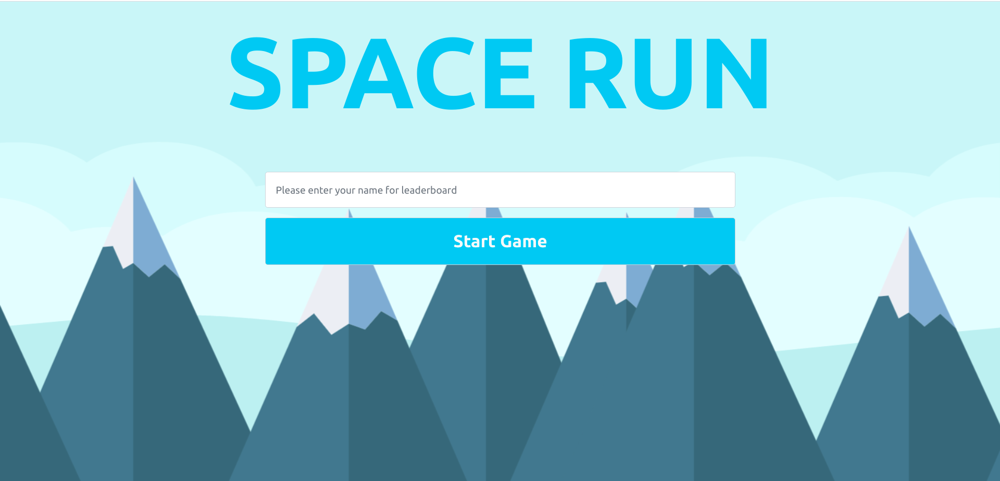
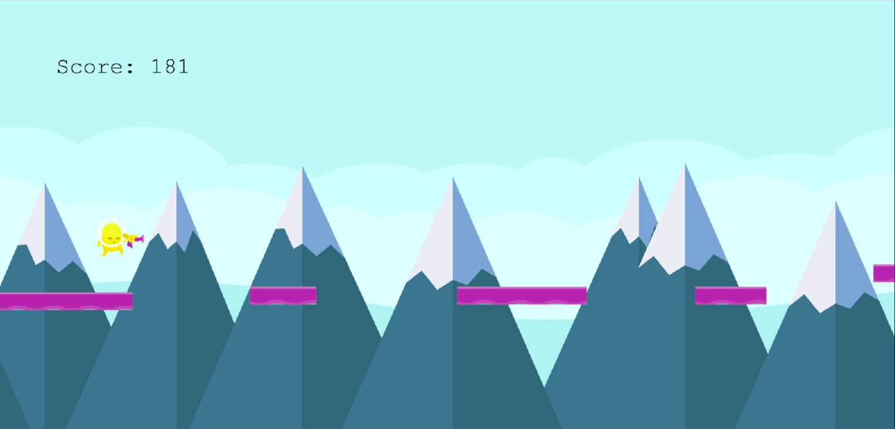
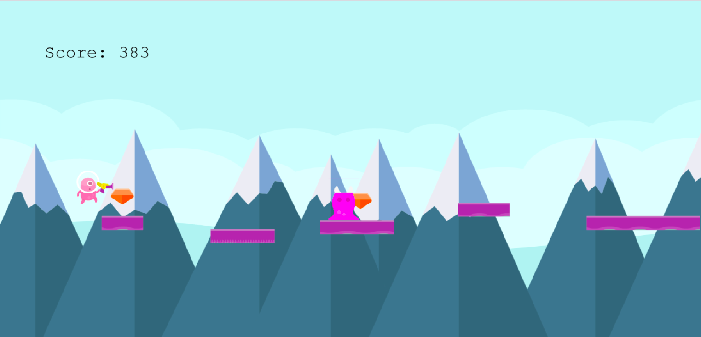
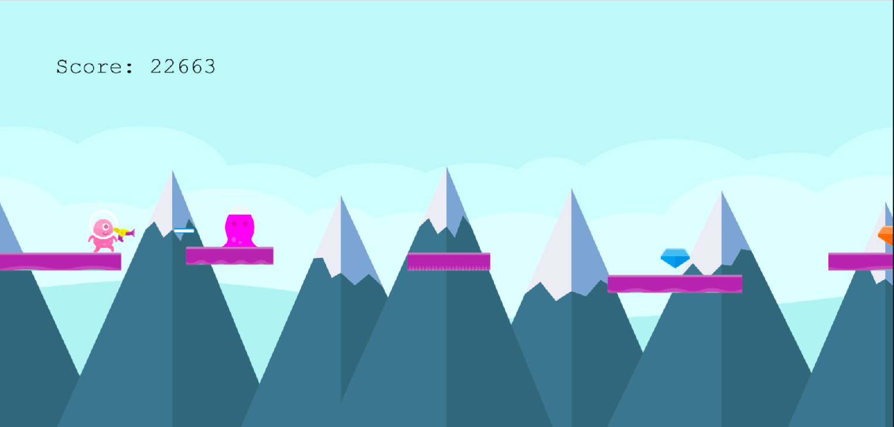
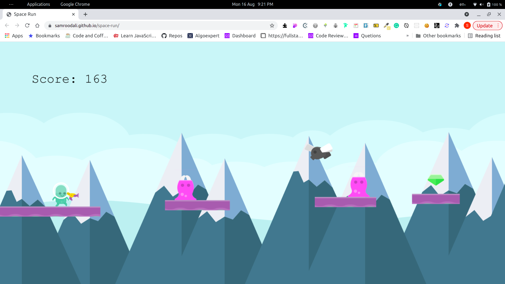

# SPACE RUN
  Help this cute alien collect gems while killing bees and plants on the way !!.

## Game Instructions
[Click here to play the game](https://samroodali.github.io/space-run/)</p>



The game asks you for your name before playing. Enter your name as it helps have your name in the game leaderboards. You can compete with your friends. Try to get the higest scores and beat them all.
Once you have entered your name, click `start` or press `Enter` to start the game.



Click `Left mouse button` to jump. Press it again to jump mid air.
Surive by jumping from platforms to platforms. You will lose the game if you fall off a platform or jump but do not make it to the next platform. Fret not, for you can jump with a mouse click. Feel like a jump is not enough, jump again. You got double jumps before landing the next platform.



The alien's main goal is to collect gems. Gems are worth `10000` points. There is also a suprise hidden in these gems!!. Gems bring your friends into the game.

### Aliens in the game


### Laser Gun


##### Loaded gun

You are in a differnet planet, you have no idea what is awaiting you. Your instincts tell you that collecting those gems might prove to be difficult. So you have decided to bring your trusty revolver laser gun. Press `Space key` to shoot. Other than the obvious laser, there is also an animation whenever you fire.
Life is not that easy though. You can only fire `6 laser shots` before your gun is empty.An empty gun looks different. It looks, well, empty.

##### Empty gun


Don't worry, you have unlimited lasers. Wait a while for the gun to be reloaded and start firing again. Make sure you are prudent with your shots and does not end up in a scenario where you have a giant bee heading towards you but your gun is reloading.### Enemies

### Enemies in the game


#### Bees

These bees do sting and kill you. Shoot them down with your laser gun.
#### Flies

Distant cousins of the bees. There are a lot of these cousins. They are crazy but your gun can handle them. They will kill you on contact.

#### Barnacle

Barnacles are a special deadly alien eating species of plants and can be found on platforms. You do not want to gift these plants to anyone. They will Kill you if you touch them. Kill them with your gun or jump over them if you find them too cute to kill.
## Built With
- Phaser  
- Javascript
- Webpack
- CSS Bootstrap

## Live Demo

Click on the link below for accessing the deployed website.
### [Play Space Run](https://samroodali.github.io/space-run/)</p>


## Getting Started

To get a local copy up and running follow these simple example steps.

### Prerequisites
- A browser
- Node js (optional)

### Setup

All code below are for a terminal.

1. Clone repository: 
```sh
  $ git clone https://github.com/SamroodAli/space-run.git
```
2. Change directory inside project
```sh
cd space-run
```
3. In your terminal, run 
```sh
npm install
```
4. After changes, run webpack to build production code.
```sh
npm run build
```
5. You can now open the `index.html` file in `dist folder` in any browser.
   
6. You can also run the following to access the website on `http://localhost:5000` in your local computer.
```sh
npm run serve
```
* Press `Ctrl + c` to exit the `npm run serve` session in your terminal.

### Testing the application

* Run the command to run tests
```sh
  npm run test
```
* Press `q` to exit the test session
* Press `a` to run the tests again.

## Author


👤 **Samrood Ali**
- GitHub: [@githubhandle](https://github.com/SamroodAli)
- LinkedIn: [LinkedIn](https://www.linkedin.com/in/samrood-ali/)

## 🤝 Contributing

Contributions, issues, and feature requests are welcome!

Feel free to check the [issues page](https://github.com/SamroodAli/space-run/issues).

## Show your support

Give a ⭐️ if you like this project!

## Acknowledgments

- Hat tip to anyone whose code was used
- Inspiration
- etc

## 📝 License

This project is [MIT](/LICENSE) licensed.
